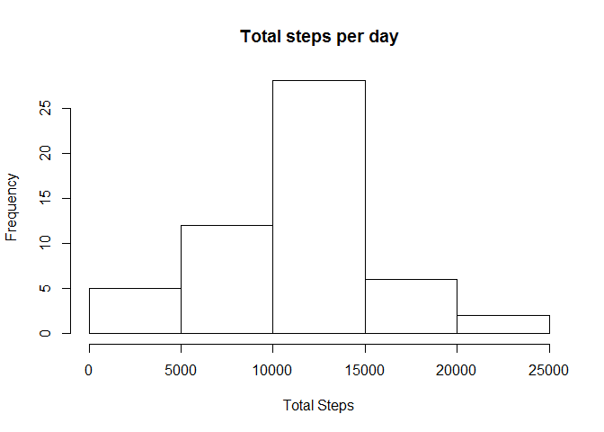
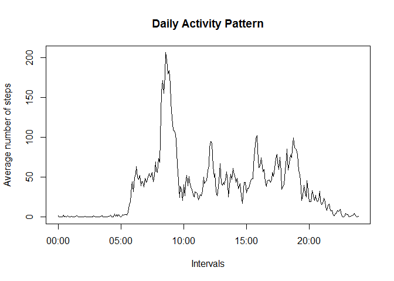
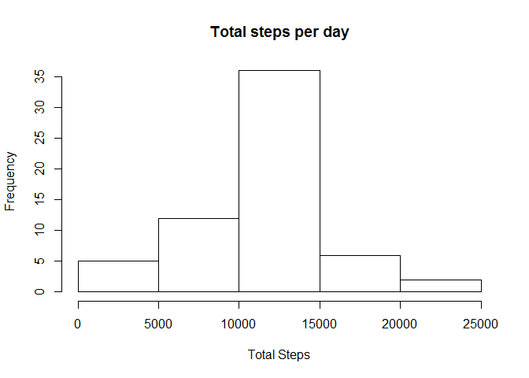
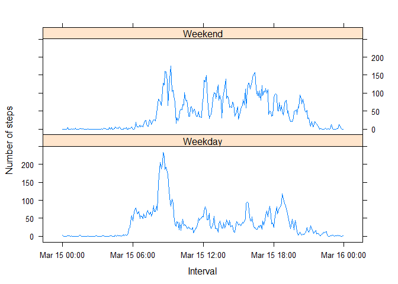

Reproducible Research Peer Assessment 1
=======================================

Coursera Course: Reproducible Research

Assessment 1

11th March 2015

## Introduction
The following analysis was performed on data obtained from a personal activity monitoring device such as a Fitbit, Nike Fuelband,etc. Device collects number of steps data every five minutes. The data was collected over a sample period of 2 months from October and November 2012 from an anonymous individual. 

Data url -> https://d396qusza40orc.cloudfront.net/repdata%2Fdata%2Factivity.zip

Extract the data into the folder with the rmd file to reproduce the following charts.

###Tools used

R Studio and the knitr package in R was used to generate the following R Markdown file which has been suitably uploaded to a github repository.

##Loading and Preprocessing the Data

We are essentially reading the csv file which contains 3 columns - Number of steps, Date and Time interval. 


```r
#Reading the data
activity<-read.csv("activity.csv",na.string="NA")
head(activity)
```

```
##   steps       date interval
## 1    NA 2012-10-01        0
## 2    NA 2012-10-01        5
## 3    NA 2012-10-01       10
## 4    NA 2012-10-01       15
## 5    NA 2012-10-01       20
## 6    NA 2012-10-01       25
```

```r
str(activity)
```

```
## 'data.frame':	17568 obs. of  3 variables:
##  $ steps   : int  NA NA NA NA NA NA NA NA NA NA ...
##  $ date    : Factor w/ 61 levels "2012-10-01","2012-10-02",..: 1 1 1 1 1 1 1 1 1 1 ...
##  $ interval: int  0 5 10 15 20 25 30 35 40 45 ...
```
##What is mean total number of steps taken per day?

This calculation involves us summing up the number of steps taken by the individual per day and then calculating the mean and median total number of steps per day. This can be visualized using a Histogram plot


```r
# Obtaining the total number of steps per day

Totalsteps<-tapply(activity$steps,activity$date,sum)
#Histogram of the total steps data ignoring missing data.
hist(Totalsteps,main="Total steps per day",xlab="Total Steps",breaks=6)
```

 

```r
# Calculating the mean and median of the given total steps per day data
mean(Totalsteps,na.rm=T)
```

```
## [1] 10766.19
```

```r
median(Totalsteps,na.rm=T)
```

```
## [1] 10765
```

##What is the average daily activity pattern?

This bit of analysis involves making a time series plot of each 5 minute interval and the average number of steps taken averaged over each interval 


```r
##generating the mean number of steps data per time interval
agg<-aggregate(steps~interval,data=activity,mean)
intervals <- strptime(sprintf("%04d", as.numeric(agg$interval)), format="%H%M")
plot(intervals,agg$steps,type="l",xlab="Intervals",ylab="Average number of steps",main="Daily Activity Pattern")
```

 

```r
#To find the 5 minute interval which contains the maximum number of steps on average

agg$interval[which.max(agg$steps)]
```

```
## [1] 835
```

##Imputing missing values

Compared to the previous analysis, this takes into account the missing value data.We simply replace the missing value data with the average number of steps for that specific time period. For example, 0800-NA is replaced with the average number of steps at 0800


```r
##This gives you the number of missing values in the given dataset
sum(is.na(activity))
```

```
## [1] 2304
```

```r
#Using mean for the missing steps values
new_activity<-merge(activity,agg,by="interval", suffixes=c("",".y"))

nast<-is.na(new_activity$steps)
new_activity$steps[nast]<-new_activity$steps.y[nast]
new_activity<-new_activity[,c(1:3)]
#new_activity is the new data set


#Taking the sum of the steps
Totalsteps<-tapply(new_activity$steps,new_activity$date,sum)
#Histogram of the total steps data ignoring missing data.
hist(Totalsteps,main="Total steps per day",xlab="Total Steps",breaks=6)
```

 

```r
# Calculating the mean and median of the given total steps per day data
mean(Totalsteps,na.rm=T)
```

```
## [1] 10766.19
```

```r
median(Totalsteps,na.rm=T)
```

```
## [1] 10766.19
```
We can clearly see that replacing the missing data with the average of the overall data does not affect the mean. This does however skew the median to the mean value.

##Are there differences in activity patterns between weekdays and weekends?

The given data is separated into weekdays and weekends and a simple graph to the previous average walking pattern is drawn.


```r
#Generating weekdays and Weekends data using the weekdays function
activity$date <- as.Date(activity$date, "%Y-%m-%d")

day <- weekdays(activity$date)
#generates the weekend/weekday separation
daylevel <- vector()
for (i in 1:nrow(activity)) {
    if (day[i] == "Saturday") {
        daylevel[i] <- "Weekend"
    } else if (day[i] == "Sunday") {
        daylevel[i] <- "Weekend"
    } else {
        daylevel[i] <- "Weekday"
    }
}

activity$daylevel <- daylevel
activity$daylevel <- factor(activity$daylevel)

agg2 <- aggregate(steps ~ interval + daylevel, data = activity, mean)

names(agg2) <- c("interval", "daylevel", "steps")

# Note: using the as.POSIXct function causes the intervals data to convert to intervals for this given day. This unfortunately causes my plot to contain the day as well and i don't particularly know how to remove that bit of data.
agg2$interval<-as.POSIXct(intervals)


library(lattice)

xyplot(steps ~ interval | daylevel, agg2, type = "l", layout = c(1, 2), xlab = "Interval", ylab = "Number of steps")
```

 

